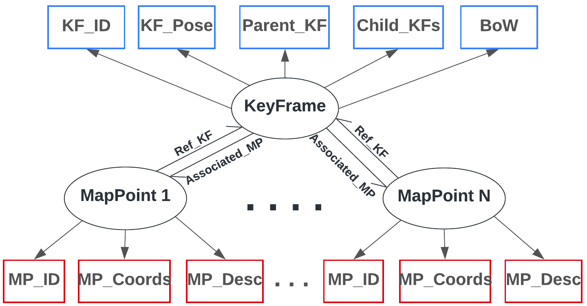

<html>
    <table style="width:100%;border:0px;border-spacing:0px;border-collapse:separate;margin-right:auto;margin-left:auto;font-size:90%;">
          <tr onmouseout="nightsight_stop()" onmouseover="nightsight_start()">
            <td style="padding:20px;width:25%;vertical-align:middle;border-left-style:none;border-bottom-style:none;border-top-style:none;border-right-style:none">
              
            </td>
            <td style="padding:20px;width:75%;vertical-align:middle;border-left-style:none;border-bottom-style:none;border-top-style:none;border-right-style:none">
                <papertitle><strong>PLK-Calib: Single-shot and Target-less LiDAR-Camera Extrinsic Calibration using Plucker Lines</strong>
                </papertitle>
               
                <strong>Y. Zhang</strong>, J. Xu, and W. Ren
               
              <em>IEEE/RSJ International Conference on Intelligent Robots and Systems (IROS), 2025. [Under Review]</em> 
            </td>
          </tr>
    </table>
    <table style="width:100%;border:0px;border-spacing:0px;border-collapse:separate;margin-right:auto;margin-left:auto;font-size:90%;">
          <tr onmouseout="nightsight_stop()" onmouseover="nightsight_start()">
            <td style="padding:20px;width:25%;vertical-align:middle;border-left-style:none;border-bottom-style:none;border-top-style:none;border-right-style:none">
              
            </td>
            <td style="padding:20px;width:75%;vertical-align:middle;border-left-style:none;border-bottom-style:none;border-top-style:none;border-right-style:none">
                <papertitle><strong>Multi-robot Dual Reinforcement Learning Framework for Hybrid Motion Planning</strong>
                </papertitle>
               
                J. Xu, D. Wang, <strong>Y. Zhang</strong>, and W. Ren
               
              <em>IEEE Conference on Control Technology and Applications (CCTA), 2025. [Under Review]</em> 
            </td>
          </tr>
    </table>
    <table style="width:100%;border:0px;border-spacing:0px;border-collapse:separate;margin-right:auto;margin-left:auto;font-size:90%;">
          <tr onmouseout="nightsight_stop()" onmouseover="nightsight_start()">
            <td style="padding:20px;width:25%;vertical-align:middle;border-left-style:none;border-bottom-style:none;border-top-style:none;border-right-style:none">
              
            </td>
            <td style="padding:20px;width:75%;vertical-align:middle;border-left-style:none;border-bottom-style:none;border-top-style:none;border-right-style:none">
                <papertitle><strong>NeRF-VIO: Map-Based Visual-Inertial Odometry with Initialization Leveraging Neural Radiance Fields</strong>
                </papertitle>
               
                <strong>Y. Zhang</strong>, D. Wang, J. Xu, M. Liu, P. Zhu, and W. Ren
               
              <em>IEEE 21st International Conference on Automation Science and Engineering (CASE), 2025.</em> 
            </td>
          </tr>
    </table>
    <table style="width:100%;border:0px;border-spacing:0px;border-collapse:separate;margin-right:auto;margin-left:auto;font-size:90%;">
          <tr onmouseout="nightsight_stop()" onmouseover="nightsight_start()">
            <td style="padding:20px;width:25%;vertical-align:middle;border-left-style:none;border-bottom-style:none;border-top-style:none;border-right-style:none">
              
            </td>
            <td style="padding:20px;width:75%;vertical-align:middle;border-left-style:none;border-bottom-style:none;border-top-style:none;border-right-style:none">
                <papertitle><strong>CooperSLAM: Infrastructure-less Cooperative SLAM for Interactive Multi-user Augmented Reality</strong>
                </papertitle>
               
                <strong>Y. Zhang</strong>, J. Yue, W. Ren, J. Chen, S. Krishnamurthy, and H. Qiu
               
              <em>22nd USENIX Symposium on Networked Systems Design and Implementation (NSDI), 2025. [Under Review]</em> 
            </td>
          </tr>
    </table>
    <table style="width:100%;border:0px;border-spacing:0px;border-collapse:separate;margin-right:auto;margin-left:auto;font-size:90%;">
          <tr onmouseout="nightsight_stop()" onmouseover="nightsight_start()">
            <td style="padding:20px;width:25%;vertical-align:middle;border-left-style:none;border-bottom-style:none;border-top-style:none;border-right-style:none">
              
            </td>
            <td style="padding:20px;width:75%;vertical-align:middle;border-left-style:none;border-bottom-style:none;border-top-style:none;border-right-style:none">
                <papertitle><strong>Distributed Road-Map Monitoring Using Onboard Sensors</strong>
                </papertitle>
               
                <strong>Y. Zhang</strong>, M. Greiff, W. Ren, and K.Berntorp
               
              <em>American Control Conference (ACC), 2024.</em> 
              <a href="https://ieeexplore.ieee.org/document/10644978"><strong>[Paper]</strong></a>
              <a href="https://www.merl.com/publications/docs/TR2024-093.pdf"><strong>[PDF]</strong></a>
            </td>
          </tr>
    </table>
    <table style="width:100%;border:0px;border-spacing:0px;border-collapse:separate;margin-right:auto;margin-left:auto;font-size:90%;">
          <tr onmouseout="nightsight_stop()" onmouseover="nightsight_start()">
            <td style="padding:20px;width:25%;vertical-align:middle;border-left-style:none;border-bottom-style:none;border-top-style:none;border-right-style:none">
              
            </td>
            <td style="padding:20px;width:75%;vertical-align:middle;border-left-style:none;border-bottom-style:none;border-top-style:none;border-right-style:none">
                <papertitle><strong>Moving Target Estimation and Active Tracking in Multi-Robot Systems</strong>
                </papertitle>
               
                J. Xu, P. Zhu, <strong>Y. Zhang</strong>, and W. Ren
               
              <em>IEEE Conference on Decision and Control (CDC), 2023.</em> 
              <a href="https://ieeexplore.ieee.org/document/10383940"><strong>[Paper]</strong></a>
            </td>
          </tr>
    </table>
    <table style="width:100%;border:0px;border-spacing:0px;border-collapse:separate;margin-right:auto;margin-left:auto;font-size:90%;">
          <tr onmouseout="nightsight_stop()" onmouseover="nightsight_start()">
            <td style="padding:20px;width:25%;vertical-align:middle;border-left-style:none;border-bottom-style:none;border-top-style:none;border-right-style:none">
              
            </td>
            <td style="padding:20px;width:75%;vertical-align:middle;border-left-style:none;border-bottom-style:none;border-top-style:none;border-right-style:none">
                <papertitle><strong>PL-CVIO: Point-Line Cooperative Visual-Inertial Odometry</strong>
                </papertitle>
               
                <strong>Y. Zhang</strong>, P. Zhu, and W. Ren
               
              <em>IEEE Conference on Control Technology and Applications (CCTA), 2023.</em> 
              <a href="https://ieeexplore.ieee.org/document/10253266"><strong>[Paper]</strong></a>
              <a href="https://arxiv.org/pdf/2311.05717.pdf"><strong>[arxiv]</strong></a>
              <a href="https://www.youtube.com/watch?v=nDE9S8CzRk4"><strong>[Video]</strong></a>
            </td>
          </tr>
    </table>
    <table style="width:100%;border:0px;border-spacing:0px;border-collapse:separate;margin-right:auto;margin-left:auto;font-size:90%;">
          <tr onmouseout="nightsight_stop()" onmouseover="nightsight_start()">
            <td style="padding:20px;width:25%;vertical-align:middle;border-left-style:none;border-bottom-style:none;border-top-style:none;border-right-style:none">
              
            </td>
            <td style="padding:20px;width:75%;vertical-align:middle;border-left-style:none;border-bottom-style:none;border-top-style:none;border-right-style:none">
                <papertitle><strong>Visual Navigation Using Sparse Optical Flow and Time-to-Transit</strong>
                </papertitle>
               
                C. Boretti, P. Bich, <strong>Y. Zhang</strong>, and J. Baillieul
               
              <em>IEEE International Conference on Robotics and Automation (ICRA), 2022.</em> 
              <a href="https://ieeexplore.ieee.org/document/9812032"><strong>[Paper]</strong></a>
              <a href="https://arxiv.org/pdf/2111.09669.pdf"><strong>[arXiv]</strong></a>
              <a href="https://github.com/johnbaillieul/Vision_based_Navigation_TTT"><strong>[GitHub]</strong></a>
            </td>
          </tr>
    </table>
    <table style="width:100%;border:0px;border-spacing:0px;border-collapse:separate;margin-right:auto;margin-left:auto;font-size:90%;">
          <tr onmouseout="nightsight_stop()" onmouseover="nightsight_start()">
            <td style="padding:20px;width:25%;vertical-align:middle;border-left-style:none;border-bottom-style:none;border-top-style:none;border-right-style:none">
              
            </td>
            <td style="padding:20px;width:75%;vertical-align:middle;border-left-style:none;border-bottom-style:none;border-top-style:none;border-right-style:none">
                <papertitle><strong>3D Object Detection and Tracking Using Monocular Camera in CARLA</strong>
                </papertitle>
               
                <strong>Y. Zhang</strong>, J. Song, and S. Li
               
              <em>IEEE International Conference on Electro Information Technology (EIT), 2021.</em> 
              <a href="https://ieeexplore.ieee.org/document/9491905"><strong>[Paper]</strong></a>
              <a href="https://github.com/zhangyanyu0722/Carla_3D_Tracking"><strong>[GitHub]</strong></a>
              <a href="https://www.youtube.com/watch?v=-b9xSzzZPd8"><strong>[Video]</strong></a>
            </td>
          </tr>
    </table>
    <table style="width:100%;border:0px;border-spacing:0px;border-collapse:separate;margin-right:auto;margin-left:auto;font-size:90%;">
          <tr onmouseout="nightsight_stop()" onmouseover="nightsight_start()">
            <td style="padding:20px;width:25%;vertical-align:middle;border-left-style:none;border-bottom-style:none;border-top-style:none;border-right-style:none">
              
            </td>
            <td style="padding:20px;width:75%;vertical-align:middle;border-left-style:none;border-bottom-style:none;border-top-style:none;border-right-style:none">
                <papertitle><strong>5G utility pole planner using Google Street View and Mask R-CNN</strong>
                </papertitle>
               
                <strong>Y. Zhang</strong>, and O. Alshaykh
               
              <em>IEEE International Conference on Electro Information Technology (EIT), 2020.</em> 
              <a href="https://ieeexplore.ieee.org/document/9208333"><strong>[Paper]</strong></a>
              <a href="https://arxiv.org/pdf/2008.11689.pdf"><strong>[arXiv]</strong></a>
              <a href="https://github.com/zhangyanyu0722/5G-Utility-Pole-Planner"><strong>[GitHub]</strong></a>
            </td>
          </tr>
    </table>
    <table style="width:100%;border:0px;border-spacing:0px;border-collapse:separate;margin-right:auto;margin-left:auto;font-size:90%;">
          <tr onmouseout="nightsight_stop()" onmouseover="nightsight_start()">
            <td style="padding:20px;width:25%;vertical-align:middle;border-left-style:none;border-bottom-style:none;border-top-style:none;border-right-style:none">
              
            </td>
            <td style="padding:20px;width:75%;vertical-align:middle;border-left-style:none;border-bottom-style:none;border-top-style:none;border-right-style:none">
                <papertitle><strong>Intelligent hotel ROS-based service robot</strong>
                </papertitle>
               
                <strong>Y. Zhang</strong>, X. Wang, X. Wu, W. Zhang, M. Jiang and M. Al-Khassaweneh
               
              <em>IEEE International Conference on Electro Information Technology (EIT), 2019.</em> 
              <a href="https://ieeexplore.ieee.org/document/8834040"><strong>[Paper]</strong></a>
              <a href="https://arxiv.org/pdf/2009.00594.pdf"><strong>[arXiv]</strong></a>
              <a href="https://github.com/zhangyanyu0722/Intelligent-Hotel-ROS-based-Service-Robot"><strong>[GitHub]</strong></a>
            </td>
          </tr>
    </table>
</html>